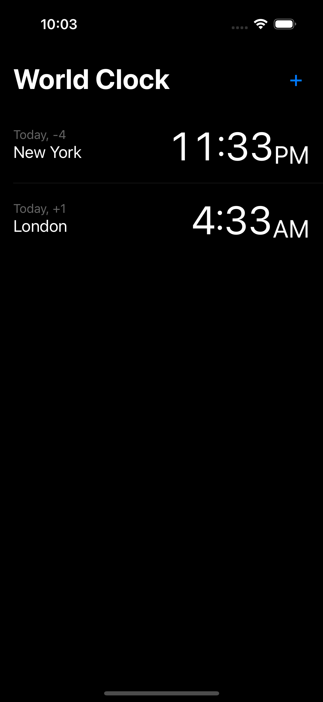
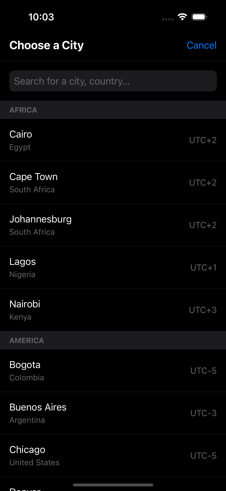

# React Native World Clock App

A sample React Native application that demonstrates building a World Clock app similar to iOS's Clock app. This project showcases various React Native and Redux concepts along with TypeScript integration.

## Features

- Display multiple time zones with real-time updates
- Add/Remove time zones
- Search functionality for cities and countries
- Swipe-to-delete functionality
- Dark mode UI matching iOS design
- Redux state management
- TypeScript implementation

## Prerequisites

- Node.js >= 14
- npm or yarn
- React Native development environment set up
- iOS Simulator (for iOS) or Android Emulator (for Android)

## Installation

1. Clone the repository:
```bash
git clone https://github.com/ganeshwaje/WorldClockAppReactNative.git
cd WorldClockAppReactNative
```

2. Install dependencies:
```bash
npm install
# or
yarn install
```

3. Install iOS dependencies (iOS only):
```bash
cd ios
pod install
cd ..
```

## Running the App

For iOS:
```bash
npx react-native run-ios
```

For Android:
```bash
npx react-native run-android
```

## Project Structure

```
src/
├── App.tsx                 # Main application component
├── components/
│   └── AddTimeZoneModal.tsx  # Modal for adding new time zones
├── screens/
│   └── WorldClockScreen.tsx  # Main screen component
├── store/
│   ├── index.ts            # Redux store configuration
│   └── clockSlice.ts       # Redux slice for clock functionality
└── resources/
    └── timeZones.json      # Time zone data
```

## Technologies Used

- React Native
- TypeScript
- Redux Toolkit
- React Native Gesture Handler (for swipe actions)
- date-fns-tz (for timezone calculations)

## Features Implementation

### Time Zone Management
- Uses Redux for state management
- Implements time zone addition and removal
- Real-time updates using React's useEffect

### Swipe-to-Delete
- Implemented using React Native Gesture Handler
- iOS-style delete animation
- Confirmation dialog before deletion

### Search Functionality
- Filter by city name, country, or time zone
- Grouped by continents
- Real-time search updates

### Data Structure
- Comprehensive time zone data in JSON format
- Includes major cities worldwide
- Contains UTC offsets and country information

## Styling

The app follows iOS design guidelines with:
- Dark mode theme
- Native-like animations
- Proper typography and spacing
- Consistent with iOS Clock app appearance

## Contributing

This is a sample project for learning purposes. Feel free to:
1. Fork the repository
2. Create your feature branch
3. Commit your changes
4. Push to the branch
5. Create a new Pull Request

## Learning Points

This project demonstrates:
1. React Native development best practices
2. Redux state management implementation
3. TypeScript integration in React Native
4. iOS-style UI/UX implementation
5. Real-time updates and time zone handling
6. Gesture handling in React Native
7. Modular component architecture

## License

This project is licensed under the MIT License - see the  file for details.

## Acknowledgments

- Inspired by the iOS Clock app
- Uses time zone data from standard time zone database
- Built for educational purposes

## Screenshots



## Future Improvements

Potential enhancements:
1. Add support for daylight saving time
2. Implement time zone reordering
3. Add settings persistence
4. Include more cities and time zones
5. Add multiple theme support